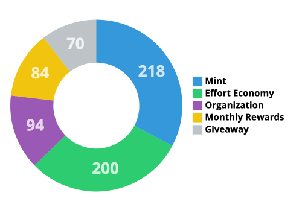

# 📈 Tokenomics

## Supply distribution


There are 13 drops, each with 666 NFTs in it for a total of 8658 NFTs. Drop 1, 2, 3 are sold out and drop 4 to be announced.


### Drop 1

* **Launch Date**: <mark style="color:green;"></mark> <mark style="color:blue;">Friday 13 May 2022</mark>
* **Mint Price:** <mark style="color:blue;">0.0666 EGLD</mark> **-** 2.84$
* **Funds raised:** <mark style="color:blue;">13.6 EGLDs</mark> <mark style="color:yellow;">-</mark> 579.95$

<figure><figcaption></figcaption></figure>

### Drop 2

* **Launch Date**: <mark style="color:blue;">Friday 30 July 2022</mark>
* **Mint Price:** <mark style="color:blue;">0.1 EGLD</mark> - 4.26$
* **Funds raised:** <mark style="color:blue;">21.5 EGLDs</mark> <mark style="color:yellow;"></mark> - 916.84$

<figure><figcaption></figcaption></figure>

### Drop 3

* **Launch Date**: <mark style="color:blue;">Friday 13 January 2023</mark>
* **Mint Price:** <mark style="color:blue;">0.23 EGLD</mark> - 9.83$
* **Funds raised:** <mark style="color:blue;">72.06 EGLDs</mark> <mark style="color:yellow;"></mark> - 3068.31$

****

<figure><figcaption></figcaption></figure>

### Drop 4

* **Mint Price:** <mark style="color:blue;">TBA</mark>
* **Launch Date**: <mark style="color:blue;">TBA</mark>

<figure><figcaption></figcaption></figure>


The next drops will be distributed progressively by members’ votes.


## Statistics

* **Total Mint:** <mark style="color:blue;">107.16 EGLDs</mark> - 4562.87$
* **Total Volume:** <mark style="color:blue;">65.5 EGLDs</mark> <mark style="color:blue;"></mark><mark style="color:blue;"><mark style="color:yellow;"><mark style="color:yellow;"></mark> - <mark style="color:yellow;"></mark> 2780.47$
* **Royalties:** <mark style="color:yellow;"></mark> <mark style="color:blue;">6.53 EGLDs</mark> - <mark style="color:yellow;"></mark> 278.04$
* **Total holders:** <mark style="color:blue;">484</mark>


23.65% of the total supply has already been minted.


## Project going&#x20;

Contributions from the Gokai Labs are 117 EGLDs.


For every EGLD, **100%** is staked.


* **100%** of the mint goes to stake in EGLD.
* **100%** of the royalties go to stake in EGLD.
* **100%** of the EGLD staking rewards go to the passive income.

## Wallets and SCs

* **Staked EGLD:** <mark style="color:blue;">230 EGLDs</mark> - 9812.97$

#### GhostVerse Wallet - 130 EGLD

The GhostVerse wallet is on a secure Ledger and will be gradually migrated to a multi-sig solution like xSafe or Peerme.&#x20;



#### Gokai Labs Wallet - 100 EGLD

Gokai Labs holds its 100 EGLDs contribution in its xPortal application as a backup and to participate in xLaunchpad. 100% are staked and 100% of the rewards are distributed to members as passive income.



#### Minting Smart Contract


